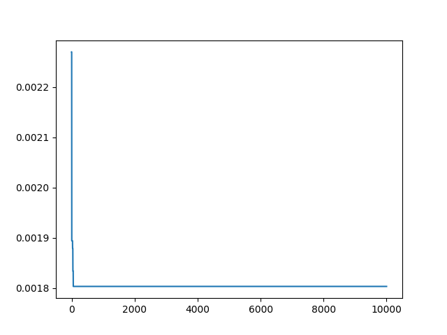

# Compilerops

How do different compiler flags lead to different optimizations and performance results?

1. Write a simple program with two loops.
2. The architecture is pinned, but we can eventually try on different machines.
3. The version of g++ is important - to start we will pin with my host (and then vary)
4. Create a container with some version of g++ (as stated we can eventually vary)
5. We need to programatically derive flags.
6. Once we have flags, we need to randomly choose a set, compile, and save if it worked, and how fast it runs.
7. Try different models to select for flags that work, and record time on successful run!

For the last point, the easiest thing to do is have the script time itself.

## Usage

### Dependencies

```bash
$ python -m venv env
$ source env/bin/activate
$ pip install -r requirements.txt
```

### Generate Flags

```bash
$ python compilerops.py gen g++
```

Will generate filtered [data/gpp_flags.json](data/gpp_flags.json)


### Running Models

Models will output results in [data/results](data/results)

#### Monte Carlo

A monte carlo simulation is the most basic thing we can try - the idea is that we represent the flags
as a vector of 0/1, and then on each iteration, randomly switch a bit. If we get a better outcome (a faster or smaller number for the time)
we keep that switch. Otherwise we don't and keep trying other things.

```bash
$ python montecarlo.py run data/gpp_flags.json main.cpp
```

To change the number of iterations:

```bash
$ python montecarlo.py run data/gpp_flags.json --num-iter 1000 main.cpp
```

The results will be in:

```bash
tree data/results/montecarlo
```

And as an example, here we see the times getting faster very quickly over N=1000 iterations.



Of course this is pretty random - the algorithm only has one step of memory, and it's hugely influenced by what
we happen to try. I think next I'm going to try a different algorithm called Tabu that can better search the space.
