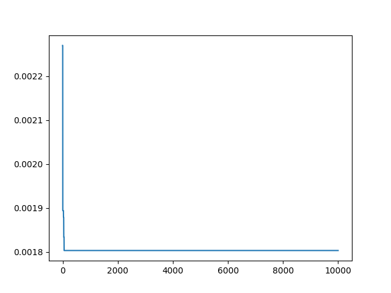
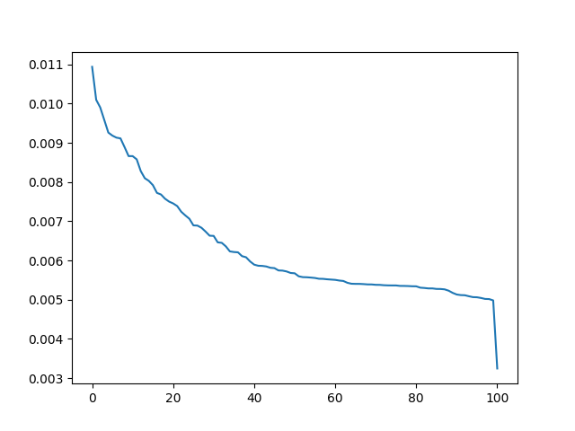

# Simple Analysis

This was my first effort using Montecarlo and tabu search to derive flag groups.

## Usage

### Dependencies

```bash
$ python -m venv env
$ source ../env/bin/activate
$ pip install -r ../requirements.txt
```

### Flags

You should have generated flags in the [../data](../data) root.

### Running Models

Models will output results in [data/results](data/results)

#### Monte Carlo

A monte carlo simulation is the most basic thing we can try - the idea is that we represent the flags
as a vector of 0/1, and then on each iteration, randomly switch a bit. If we get a better outcome (a faster or smaller number for the time)
we keep that switch. Otherwise we don't and keep trying other things.

```bash
$ python montecarlo.py run data/gpp_flags.json main.cpp
```

To change the number of iterations:

```bash
$ python montecarlo.py run data/gpp_flags.json --num-iter 1000 main.cpp
```

The results will be in:

```bash
$ tree data/results/montecarlo
data/results/montecarlo
├── 0
│   ├── gpp_flags_results.json
│   └── gpp_flags_results.png
└── 1
    ├── gpp_flags_results.json
    └── gpp_flags_results.png

2 directories, 4 files
```

You'll notice a new numbered directory is always created for a new result. 
And as an example, here we see the times getting faster very quickly over N=1000 iterations.



Of course this is pretty random - the algorithm only has one step of memory, and it's hugely influenced by what
we happen to try. I think next I'm going to try a different algorithm called Tabu that can better search the space.

#### Tabu Search

[Tabu Search](https://en.wikipedia.org/wiki/Tabu_search) is going to better sample the space, because for each step we consider all neighbors, and then choose the best one. I also refactored this one to do work in /tmp so we don't create extra files here. We could probably paralleize it to run it faster, i desired.

```bash
$ python tabu.py run data/gpp_flags.json main.cpp
```

The results will be in:

```bash
$ tree data/results/tabu
```

And with 100 iterations we find some good combinations!



